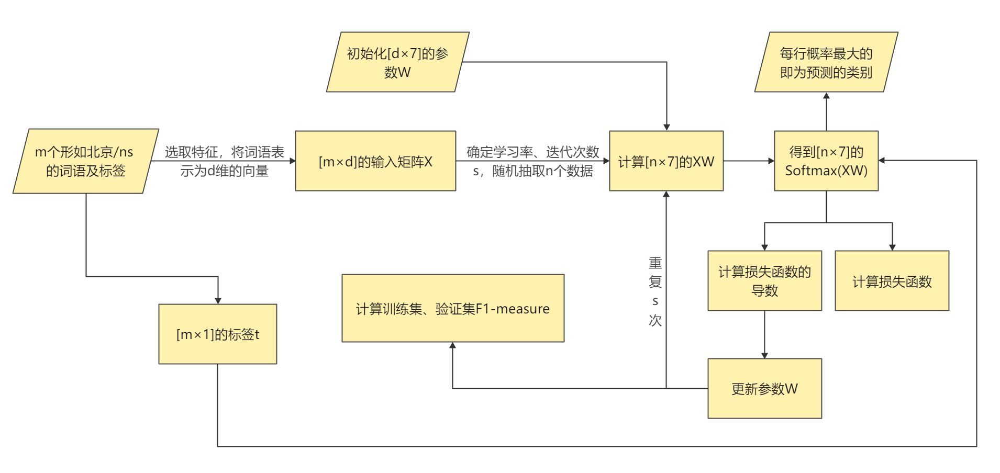

## Named Entity Recognition （NER）

命名实体识别，即对文本中具有特定意义的词进行识别，在自然语言处理领域具有基础性意义。本实验采用北京大学《人民日报》基本标注语料库， 通过构建广义线性模型，实现了对人名、地名、机构名三类实体的识别，并采用BIO表示法进行了相应的标注。

本实验主要通过以下步骤，实现了命名实体识别的目标：

1. 对原始数据集进行向量化表示，选取特征将每个词语表示为一个向量，并将对应的分类标签转化为可以参与运算的数字。
2. 生成训练集、验证集和测试集，并对训练集中的数据进行数据清洗。
3. 初始化参数W，确定学习率和迭代次数，重复步骤4~7直到达到选定的迭代次数：
4. 采用mini-batch方法，抽取一定数量的训练集数据，计算Softmax概率。对于一个输入，概率最大的即为当前模型所预测的分类。
5. 计算当前模型的损失函数值，并对其求导。
6. 根据损失函数的导数，采用梯度下降法对参数W进行更新。
7. 将模型预测的分类与实际分类进行比较，求出用于评估当前模型精确程度的训练集与验证集的F1-measure，并保存使得验证集F1-measure最大值及对应的参数W。
8. 通过改变输入词的特征选取、训练集中数据清洗的方式、训练时的学习率和迭代次数、参数W更新的方法，比较其对应的验证集F1-measure的大小，选择最好的模型用于预测。
9. 将对应模型在步骤7保留的W值用于测试集，计算其F1-measure。

