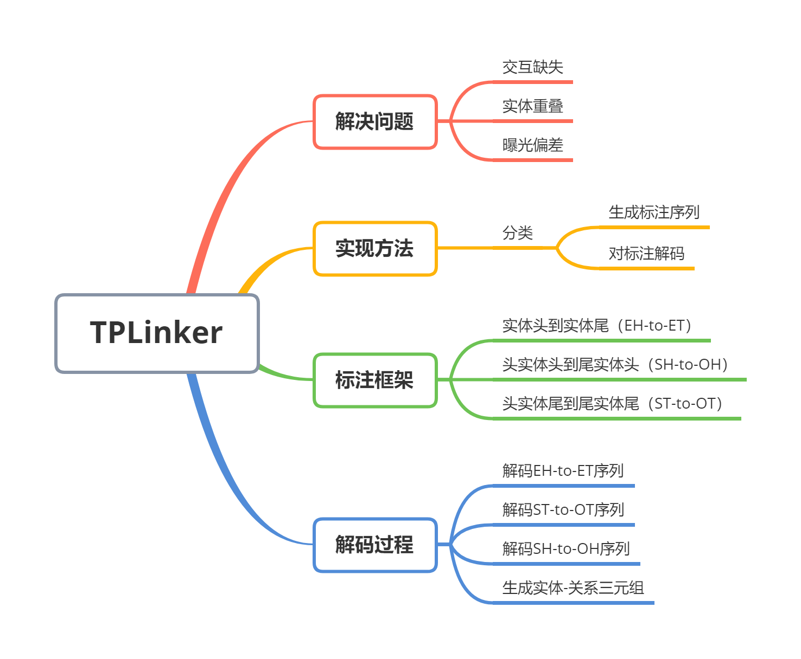
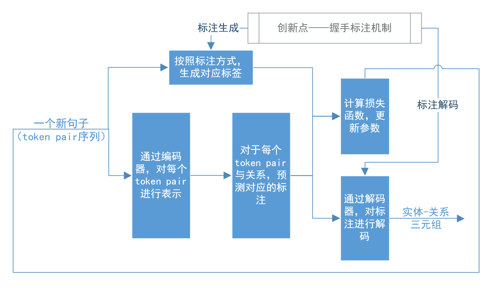

Brief introduction to [*TPLinker: Single-stage Joint Extraction of Entities and Relations Through Token Pair Linking*](https://arxiv.org/abs/2010.13415v1) in COLING 2020.

- report.pdf: text version
- video.mp4: video version

## main idea

## main method

