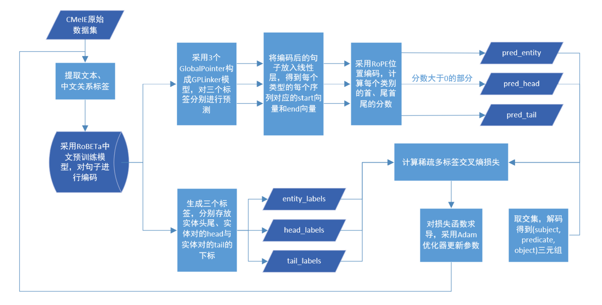

Pytorch version of [GPLINKER](https://kexue.fm/archives/8888) based on the code [xhw205/GPLinker_torch](https://github.com/xhw205/GPLinker_torch).

Changes:
- add the evaluation part and a lot of annotations
- write the main part in jupyternotebook, a more reader-friendly way.

#### 模型结构

#### 代码各文件说明

1. **模型配置**：config.ini文件

   包括数据集与预训练模型的路径、训练时的参数设置，方便了参数的管理，其中：

   - [paths]：预训练模型RoBERTa、数据集的位置
   - [paras]：训练时的参数，其中，head_size对应Multi-Head Attention中head的维度

2. **数据集存储**：datasets文件夹

   本实验采用医学实体关系抽取CMeIE数据集，以json文件的形式存储，包含以下文件：

   - 53_schema.json: SPO关系约束表
   - CMeIE_train.json: 训练集
   - CMeIE_dev.json: 验证集
   - CMeIE_test.json: 测试集

3. **数据预处理**：utils/data_loader.py文件

   该部分将数据集数据进行编码，并将数据、标签转化为可用于GPLinker模型所需要的形式。其中，data_generator类提供了pytorch的DataLoader在训练、推理时的数据生成方式。

4. **GPLinker模型**：GPlinker.py文件

   采用pytorch的神经网络库，实现了关系抽取GPLinker模型，并规定了损失函数的计算方式。

5. **优化方法**：utils/bert_optimization.py文件

   采用HuggingFace针对Bert的Adam优化器，即文件中的BertAdam函数，并在训练过程中采用权重衰减、学习率预热、梯度剪裁等方式。

6. **模型参数存储**：result/GPLinker_para.pth文件

   训练结束后，存储模型的所有参数，用于评估模式下的关系抽取预测。

7. **训练与评估**：main.ipynb文件

   完成GPLinker的正反向传播，存储各项参数，并将其用于模型的评估。
