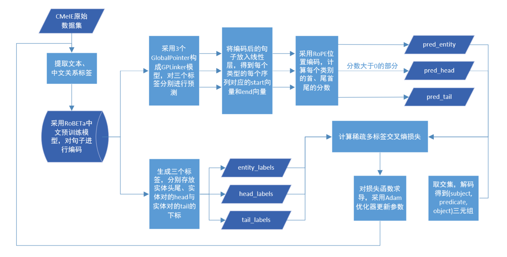

Pytorch version of [GPLINKER](https://kexue.fm/archives/8888) based on the code [xhw205/GPLinker_torch](https://github.com/xhw205/GPLinker_torch).

Changes:
- add the evaluation part and a lot of annotations
- write the main part in jupyternotebook, a more reader-friendly way.

